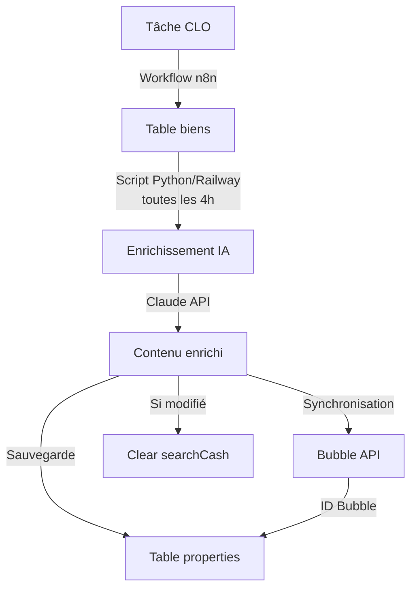

# 🔄 Automatisation N8N - Flux des Biens

## 🏠 Flux Bien - Système Complet

### 🎯 Vue d'ensemble
Le système d'alimentation des biens fonctionne via **deux workflows complémentaires** qui travaillent ensemble :
1. Un workflow n8n pour la synchronisation initiale depuis les sources externes
2. Un script Python sur Railway pour l'enrichissement IA et la synchronisation avec Bubble

## 📥 Workflow 1 - Synchronisation Initiale (n8n)

### ⚡ Description


**URL du workflow** : https://sync.weinvest.app/workflow/PWWDiTr1DRwvrh0N


Ce workflow n8n est responsable de la synchronisation initiale des biens depuis les sources externes vers la base de données.

#### 🔄 Fonctionnement

1. **📥 Récupération des biens en ligne**
   - Le workflow récupère tous les biens qui sont actuellement en ligne via une tâche clo
   - **Source** : Tâche clo (système externe)
   - **Destination** : Table `biens` dans la base de données

2. **🔄 Mise à jour de la table biens**
   - Les biens récupérés sont insérés/mis à jour dans la table
   - Les biens qui ne sont plus en ligne sont marqués comme "delete"
   - Cela garantit que la table reflète toujours l'état actuel des biens disponibles

3. **🗑️ Gestion des suppressions**
   - Tous les biens qui ne sont pas retournés par la tâche clo sont passés en statut "delete"
   - Cela permet de garder un historique tout en identifiant les biens qui ne sont plus actifs

### 📊 Tables impactées

| Table | Action | Description |
|-------|--------|-------------|
| `biens` | INSERT/UPDATE/DELETE | Table principale des biens immobiliers |

### 🔗 Intégrations

- **Entrée** : Tâche clo (API externe)
- **Sortie** : Base de données Supabase
- **Type de flux** : Synchronisation unidirectionnelle

---

## 🤖 Workflow 2 - Enrichissement IA et Alimentation Bubble (Python/Railway)

### 🎯 Vue d'ensemble
Ce script Python s'exécute **toutes les 4 heures sur Railway** et :
- Récupère les biens en ligne depuis la table `biens` (alimentée par le workflow n8n)
- Enrichit les données avec de l'IA (Claude)
- Synchronise le tout avec Bubble et la table `properties`

### 🚀 Infrastructure
- **Plateforme** : Railway
- **Fréquence** : Toutes les 4 heures
- **Langage** : Python
- **Script** : `sync.py`

### 🔑 Fonctionnalités principales

1. **📊 Récupération des biens actifs**
   - Source : Table `biens` (alimentée par le workflow n8n)
   - Filtre sur les biens non supprimés (`deleted != TRUE`)
   - États acceptés : 1 (actif) ou 6
   - Biens en ligne uniquement (`en_ligne = TRUE`)

2. **🧠 Enrichissement IA via Claude**
   - **Description IA** : Génération de descriptions HTML uniques optimisées SEO
   - **Titre IA** : Création de titres accrocheurs (max 55 caractères)
   - **Tags IA** : Génération de 2 tags courts et impactants
   - Utilise Claude 3 Sonnet avec retry automatique en cas d'erreur

3. **🔄 Synchronisation avec Bubble**
   - Création/mise à jour des biens dans Bubble
   - Gestion des suppressions (biens inactifs retirés de Bubble)
   - Mapping automatique des types de données
   - Support des environnements test et production

4. **💾 Mise à jour PostgreSQL**
   - Table cible : `properties` ou `properties_staging` (test)
   - Stockage des IDs Bubble (`_id`)
   - Sauvegarde du contenu IA généré
   - Gestion des conflits avec `ON CONFLICT`

### 📝 Script de synchronisation

**Utilisation manuelle** :
```bash
python sync.py [options]

OPTIONS:
    --test              Utilise l'URL de test de l'API
    --day DAYS          Nombre de jours de modifications à récupérer (défaut: 1)
    --batch-size SIZE   Nombre de propriétés à traiter dans chaque lot (défaut: 10)
    --batch-delay SECS  Délai en secondes entre les lots (défaut: 5)
    --property-delay SECS  Délai en secondes entre les propriétés (défaut: 1)
    --max-ia-gen NUM    Nombre maximum de générations de contenu IA par lot (défaut: 3)
```

### 🔄 Flux de données complet



### 📊 Tables impactées par le script Python

| Table | Action | Description |
|-------|--------|-------------|
| `biens` | SELECT | Source des données (alimentée par n8n) |
| `properties` | INSERT/UPDATE | Table destination avec données enrichies |
| `searchCash` | TRUNCATE | Vidée si modifications Bubble |

### 🔧 Configuration requise

- **Variables d'environnement sur Railway** :
  - `DB_URL` : URL de connexion PostgreSQL
  - `BUBBLE_API_KEY` : Clé API Bubble
  - `BUBBLE_API_URL` : URL de l'API Bubble
  - `ANTHROPIC_API_KEY` : Clé API Claude

### ⚡ Optimisations

1. **Traitement par lots** : Évite la surcharge des APIs
2. **Délais configurables** : Entre propriétés et entre lots
3. **Limite IA** : Maximum de générations IA par lot pour contrôler les coûts
4. **Retry automatique** : Gestion des erreurs API avec backoff exponentiel
5. **Cache IA** : Réutilisation du contenu IA existant si disponible

### 🚨 Points d'attention

- Les deux workflows sont **interdépendants** : le script Python dépend des données synchronisées par n8n
- Le script Python s'exécute automatiquement toutes les 4 heures sur Railway
- Les biens supprimés ou hors ligne sont retirés de Bubble
- La table `searchCash` est vidée après chaque modification Bubble
- Les générations IA peuvent échouer (rate limit, erreurs réseau)
- Un fallback sur le contenu IA existant est prévu en cas d'échec

### 📅 Chronologie type

1. **T0** : Le workflow n8n récupère les biens depuis la tâche CLO et met à jour la table `biens`
2. **T+X heures** : Le script Python sur Railway s'exécute (toutes les 4h)
3. **T+X** : Les biens sont enrichis avec l'IA et synchronisés avec Bubble
4. **T+X** : La table `properties` est mise à jour avec les données enrichies et les IDs Bubble 