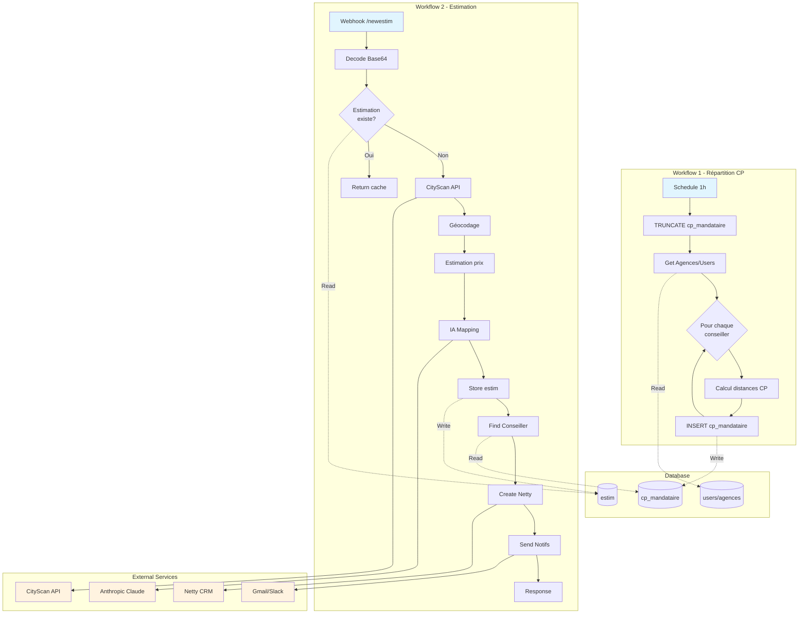
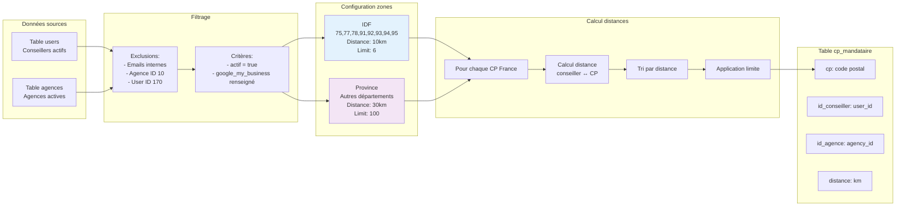
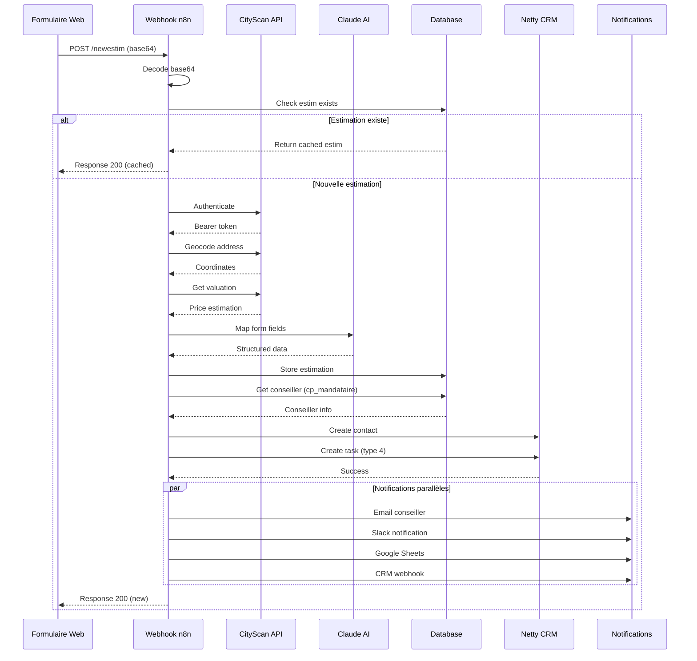
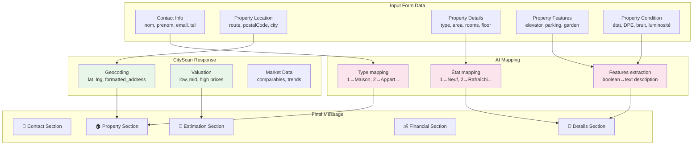

# 🏠 Estimation Immobilière

## 🎯 Vue d'ensemble

Le système d'estimation immobilière de Weinvest s'appuie sur deux workflows n8n principaux :
1. **Répartition des codes postaux par agences** : Attribution automatique des leads aux conseillers/agences selon la zone géographique
2. **Traitement des demandes d'estimation** : Gestion complète du lead depuis le formulaire jusqu'à la distribution aux conseillers

### 📊 Schéma global du système



## 🔄 Workflow 1 : Répartition des codes postaux par agences

### 📊 Description
- **URL** : https://sync.weinvest.app/workflow/m6pNeIhMMhqnrpms
- **Déclencheur** : Schedule Trigger (toutes les heures)
- **Objectif** : Créer et maintenir une table de correspondance entre codes postaux et conseillers/agences

### ⚙️ Étapes du processus

1. **Réinitialisation** : `TRUNCATE TABLE cp_mandataire`

2. **Récupération des données**
   ```sql
   SELECT * FROM (SELECT 
       COALESCE(u.user_id, a.id) AS id,
       -- Données consolidées agences/users
       -- Filtrage des utilisateurs internes
       -- Exclusion agence id=10 et user_id=170
   ) WHERE actif = true 
   AND (google_my_business != '' OR google_my_business IS NOT NULL)
   ```

3. **Analyse par conseiller/agence**
   - Pour chaque entité, récupération du user principal
   - Détermination du type : "agence" ou "conseiller"
   - Configuration selon la zone :
     - **Île-de-France** (75, 77, 78, 91, 92, 93, 94, 95) : distance 10km, limit 6
     - **Province** : distance 30km, limit 100

4. **Exécution du workflow de géolocalisation** : `hED86KLwdHs2CdaC`

### 📊 Schéma du processus de répartition



## 🔄 Workflow 2 : Traitement des demandes d'estimation

### 📊 Description
- **URL** : https://sync.weinvest.app/workflow/9ASIe7OIsp9Oymrl
- **Déclencheur** : Webhook POST `/newestim`
- **Objectif** : Traiter les demandes d'estimation, enrichir les données et distribuer aux conseillers

### ⚙️ Étapes du processus

1. **Réception et préparation des données**
   - Décodage du champ `data` (base64 → JSON)
   - Ajout de la date actuelle
   - Extraction des informations du formulaire

2. **Vérification de l'unicité**
   - ID unique : `route + postalCode + city + email`
   - Vérification dans la table `estim`
   - Si existe déjà : retour de l'estimation existante

3. **Gestion newsletter** (si newsletter = 1)
   - Appel webhook : `https://sync-webhook.weinvest.app/webhook/newsletter`

4. **Géocodage et estimation CityScan**
   ```javascript
   // Authentification
   POST https://api.cityscan.fr/security/authenticate
   
   // Géocodage
   POST https://api.cityscan.fr/solution/geocode/address
   
   // Estimation
   POST https://api.cityscan.fr/solution/realty-valuation/resale
   ```

5. **Extraction et mapping des données avec IA**
   - Utilisation d'Anthropic Claude pour mapper les champs du formulaire
   - Conversion des valeurs numériques en descriptions textuelles
   - Mapping détaillé des types de biens, états, équipements, etc.

6. **Stockage de l'estimation**
   ```sql
   UPSERT INTO estim (id, estim) VALUES (...)
   ```

7. **Génération du message formaté**
   - Template structuré avec sections :
     - 👤 Informations du contact
     - 🏠 Informations du bien
     - 📍 Caractéristiques détaillées
     - 💰 Informations financières
     - 💸 Estimation (low, mid, high)

8. **Attribution au conseiller**
   ```sql
   SELECT *, users.email as useremail
   FROM cp_mandataire
   JOIN users ON cp_mandataire.id_conseiller = users.user_id
   WHERE cp = '[code_postal]'
   ORDER BY 
       CASE WHEN id_agence > 2 THEN 0 ELSE 1 END,
       distance ASC
   LIMIT 1
   ```

9. **Création dans Netty CRM**
   - Création du contact
   - Création de la tâche (type 4)
   - Liaison contact/conseiller/agence

10. **Notifications multiples**
    - Email au conseiller via Gmail
    - Notification Slack (#notif-fr-valuation_requests)
    - Sauvegarde Google Sheets (2 onglets : estimhzv2, estimv2)
    - Webhook CRM avec segments (84 et 91)

### 📊 Schéma du flux d'estimation



### 📊 Structure des données d'estimation



## 🔗 Intégrations

### 📡 APIs utilisées
- **CityScan** : Géocodage et estimation immobilière
  - Authentification par Bearer token
  - Endpoints : `/geocode/address`, `/realty-valuation/resale`
- **Netty CRM** : Gestion contacts et tâches
  - API Key : `29843393-2425-450e-a481-c418b8a3877e`
- **Google Maps** : Enrichissement des données d'agences
- **Anthropic Claude** : IA pour mapping intelligent des champs

### 💾 Stockage des données
- **Table `cp_mandataire`** : Correspondance CP ↔ conseiller/agence
- **Table `estim`** : Cache des estimations
- **Google Sheets** : Archive des demandes (2 feuilles)

## 📈 Mapping des données

### 🏠 Types de biens
- 1 : Maison
- 2 : Appartement Simplex
- 3 : Appartement Duplex
- 4 : Appartement Triplex

### 🔧 États du bien
- 1 : Refait à neuf
- 2 : Rafraîchi
- 3 : Standard
- 4 : Rafraichissement nécessaire
- 5 : Travaux importants

### 📊 Autres mappings
- **Bruit** : 1 (Très bruyant) → 5 (Très calme)
- **Luminosité** : 1 (Sombre) → 5 (Très clair)
- **Exposition** : Nord, Sud, Est, Ouest et combinaisons
- **DPE** : A → G
- **Proximité** : 1 (Très éloignée) → 5 (Très proche)

## 🚨 Points d'attention

1. **Performance**
   - Workflow de répartition exécuté toutes les heures
   - Cache des estimations pour éviter les appels API redondants
   - Limite de 6 conseillers en IDF, 100 en province

2. **Gestion des erreurs**
   - Webhooks avec réponses différenciées selon le statut
   - Stockage des erreurs dans la table `estim`
   - `onError: continueRegularOutput` sur les étapes critiques

3. **Sécurité**
   - Authentification CityScan avec credentials sécurisés
   - Filtrage des emails internes Weinvest
   - ID unique pour éviter les doublons

4. **Priorités d'attribution**
   - Priorité aux agences avec id > 2
   - Tri par distance croissante
   - Un seul conseiller par demande

## 🔧 Configuration requise

### Variables d'environnement
- Credentials PostgreSQL
- API Key Netty
- Credentials CityScan
- OAuth Gmail
- OAuth Slack
- OAuth Google Sheets

### Tables PostgreSQL
```sql
-- Table cp_mandataire
CREATE TABLE cp_mandataire (
    cp VARCHAR,
    id_conseiller INTEGER,
    id_agence INTEGER,
    distance NUMERIC,
    -- autres champs...
);

-- Table estim
CREATE TABLE estim (
    id VARCHAR PRIMARY KEY,
    estim JSONB,
    created_at TIMESTAMP DEFAULT NOW()
);
```

### Webhooks
- `/newestim` : Réception des demandes d'estimation
- `/webhook/newsletter` : Inscription newsletter
- `/webhook/e670f46c-e9cd-43cf-9e98-b0174e6af83f` : CRM tracking 