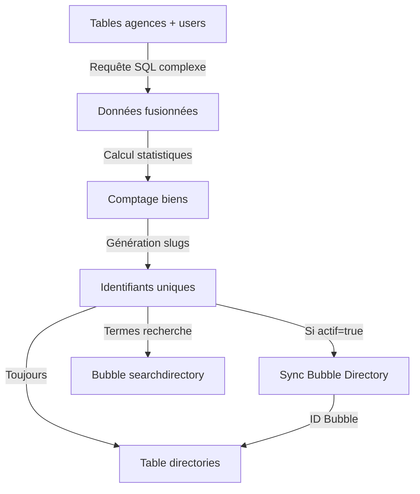

# 🏢 Automatisation - Flux des Agences et Utilisateurs

## 🏢 Flux Agences

### 🎯 Vue d'ensemble
Le système de synchronisation des agences récupère les données depuis l'API Netty, les enrichit avec des informations Google My Business, et maintient la table `agences` à jour.

## 📥 Workflow 1 - Synchronisation des Agences (n8n)

### ⚡ Description


**URL du workflow** : https://sync.weinvest.app/workflow/hc9I2FGQGRI1xwUX


Ce workflow n8n synchronise les données des agences immobilières depuis l'API Netty vers la base de données.

### 🔄 Fonctionnement détaillé

1. **⏰ Déclenchement programmé**
   - Exécution planifiée régulière (Schedule Trigger)

2. **📡 Récupération des données Netty**
   - Appel API : `https://webapi.netty.fr/apiv1/companies`
   - Récupération par lots de 10 avec pagination
   - Authentification via header `x-netty-api-key`

3. **🔄 Traitement des données**
   - Transformation des réseaux sociaux (format `social_networks_[NomReseau]`)
   - Transformation des départements couverts en deux champs :
     - `departments_covered_code` : codes départements
     - `departments_covered_name` : noms départements

4. **🌐 Enrichissement Google My Business** (si URL GMB disponible)
   - Récupération de l'ID place Google
   - Appel à l'API SerpAPI pour obtenir :
     - Horaires d'ouverture (lundi à dimanche)
     - Informations complémentaires
   - Conversion des horaires au format 24h

5. **⭐ Calcul de la note moyenne**
   - Requête SQL : `SELECT AVG(rating) FROM reviews WHERE agency_id = {company_id}`
   - Ajout de la note moyenne aux données de l'agence

6. **💾 Sauvegarde en base de données**
   - Upsert dans la table `agences` (INSERT ou UPDATE selon l'existence)
   - Clé de matching : `id` (company_id de Netty)

7. **🔔 Notification webhook**
   - Appel webhook après insertion : `https://sync-webhook.weinvest.app/webhook/...`
   - Transmission des IDs pour traitement ultérieur

### 📊 Champs synchronisés

| Champ Netty | Champ DB | Description |
|-------------|----------|-------------|
| company_id | id | Identifiant unique de l'agence |
| name | nom | Nom de l'agence |
| manager_full_name | nom_gerant | Nom du gérant |
| address | adresse | Adresse |
| postal_code | code_postal | Code postal |
| city | ville | Ville |
| email | email | Email principal |
| legal_siret_number | siret | Numéro SIRET |
| guarantee_fund_amount | montant_fonds_garantie | Montant du fonds de garantie |
| deleted | supprime | Statut de suppression |
| time_modified | date_modification | Date de dernière modification |
| social_networks_* | social_networks_* | URLs des réseaux sociaux |
| (calculé) | note_moyenne | Note moyenne des avis Google |

### 🔗 APIs et intégrations

- **API Netty** : Source principale des données agences
- **Google Maps/SerpAPI** : Enrichissement avec horaires et informations GMB
- **PostgreSQL** : Base de données de destination
- **Webhook** : Notification pour traitements complémentaires

---

## 👥 Flux Utilisateurs

### 🎯 Vue d'ensemble
Le système de synchronisation des utilisateurs (agents immobiliers) récupère les données depuis l'API Netty et maintient la table `users` à jour.

## 📥 Workflow 2 - Synchronisation des Utilisateurs (n8n)

### ⚡ Description


**URL du workflow** : https://sync.weinvest.app/workflow/6U8aAj0SBHnW6IMP


Ce workflow n8n synchronise les données des utilisateurs/agents toutes les 10 minutes.

### 🔄 Fonctionnement détaillé

1. **⏰ Déclenchement programmé**
   - Exécution toutes les 10 minutes
   - Récupération de la dernière date de modification en base

2. **📡 Récupération des données Netty**
   - Appel API : `https://webapi.netty.fr/apiv1/users`
   - Tri par date de modification décroissante
   - Pagination : 3 pages de 100 utilisateurs (0, 100, 200)
   - Authentification via header `x-netty-api-key`

3. **🔍 Filtrage des données**
   - Filtre sur les utilisateurs ayant une `time_modified`
   - Évite de traiter les utilisateurs non modifiés

4. **💾 Sauvegarde en base de données**
   - Upsert dans la table `users`
   - Clé de matching : `user_id`
   - Gestion spéciale pour certains IDs (186, 196, 204) : `user_profile = 4`

5. **🖼️ Gestion du cache d'images**
   - Format avatar : `users-{user_id}.jpg`
   - Purge du cache Imgix après mise à jour
   - API Imgix avec Bearer token pour invalidation

### 📊 Champs synchronisés

| Champ Netty | Champ DB | Description |
|-------------|----------|-------------|
| user_id | user_id | Identifiant unique |
| activated | activated | Statut d'activation |
| first_name | first_name | Prénom |
| last_name | last_name | Nom |
| email | email | Email |
| phone_mobile | phone_mobile | Téléphone mobile |
| job | job | Fonction |
| linked_company_id | linked_company_id | ID de l'agence liée |
| legal_status | legal_status | Statut légal |
| departments_covered | departments_covered | Départements couverts |
| cities_covered | cities_covered | Villes couvertes |
| presentation_short | presentation_courte | Présentation courte |
| time_created | time_created | Date de création |
| time_modified | time_modified | Date de modification |
| deleted | deleted | Statut de suppression |
| (généré) | avatar | Nom du fichier avatar |

### 🔗 APIs et intégrations

- **API Netty** : Source principale des données utilisateurs
- **PostgreSQL** : Base de données de destination
- **Imgix API** : Gestion du cache des avatars

### ⚡ Optimisations

- **Synchronisation incrémentale** : Récupération uniquement des modifications récentes
- **Traitement par lots** : Pagination pour éviter les timeouts
- **Cache d'images** : Purge automatique pour forcer le rafraîchissement des avatars

### 🚨 Points d'attention

- Les workflows agences et utilisateurs sont liés (linked_company_id)
- La fréquence de 10 minutes pour les users assure une synchronisation quasi temps réel
- Les IDs spéciaux (186, 196, 204) ont un traitement particulier pour le user_profile
- Le cache Imgix doit être purgé pour que les nouveaux avatars soient visibles

---

## 🔄 Workflow 3 - Alimentation Bubble et Table Directory (Python)

### 🎯 Vue d'ensemble
Ce script Python combine les données des agences et utilisateurs pour créer un annuaire unifié, calcule des statistiques sur les biens, et synchronise le tout avec Bubble et la table `directories`.

### 📝 Script de synchronisation

**Fichier** : Script Python de synchronisation des directories

**Utilisation** :
```bash
python sync_directories.py [options]

OPTIONS:
    --test    Utilise l'URL de test de l'API Bubble
```

### 🔄 Fonctionnement détaillé

1. **🔗 Fusion des données agences/utilisateurs**
   - Requête SQL complexe avec UNION ALL
   - Deux branches principales :
     - Agence ID 2 : Users considérés comme indépendants
     - Autres agences : Users rattachés à leur agence
   - Exclusion des emails internes Weinvest
   - Exclusion des agences ID 10 et 115

2. **📊 Calcul des statistiques**
   - **Comptage des biens actifs** par agent/agence :
     - Biens en vente (`type_offre = 1`)
     - Biens en location (`type_offre = 2`)
   - **Critères de comptage** :
     - `_id IS NOT NULL` (synchronisé avec Bubble)
     - `deleted = false`
     - `en_ligne = true`
     - `state = 1 OR state = 6`
   - **Order** : Nombre total de biens + 10000 pour les agences (pour priorisation)

3. **🏷️ Génération des slugs**
   - Pour les agents (agency_id = 2 ou annuaire = false) :
     - Format : `{nom-agent}-{user_id}`
   - Pour les agences :
     - Format : `{nom-agence}-{agency_id}`
   - Normalisation : suppression accents, espaces remplacés par tirets

4. **🔍 Gestion des termes de recherche**
   - Création d'un array `search` avec : nom, nom_agence, adresse, code_postal, ville
   - Vérification dans `searchdirectory` Bubble
   - Ajout des nouveaux termes pour l'autocomplétion

5. **🔄 Synchronisation Bubble**
   - **Conditions de synchronisation** : `actif = true`
   - **Création** : Si pas d'ID Bubble existant
   - **Mise à jour** : Si ID Bubble existant
   - **Suppression** : Si `actif = false` et ID Bubble existant

6. **💾 Sauvegarde PostgreSQL**
   - Table cible : `directories` (ou `directories_staging` en test)
   - Upsert basé sur `temp_slug`
   - Stockage de l'ID Bubble (`_id`)

### 📊 Structure des données

| Champ | Description | Source |
|-------|-------------|--------|
| id | ID unique (user_id ou agency_id) | Calculé |
| annuaire | Flag pour différencier agents/agences | Calculé |
| nom | Nom affiché | User ou agence |
| nom_agence | Nom de l'agence | Table agences |
| adresse | Adresse (vide pour agents sauf indépendants) | Conditionnel |
| telephone | Téléphone principal | Mobile, fixe ou secondaire |
| presentation | Présentation courte | User ou agence |
| actif | Statut d'activation | activated ou !supprime |
| image | URL de l'image principale | Netty ou agence |
| mignature | URL de la miniature | Priorité : mignature > image |
| google_my_business | URL GMB | Table agences |
| monday-sunday | Horaires d'ouverture | Table agences |
| note_moyenne | Note moyenne Google | Table agences |
| order | Ordre d'affichage | Nombre de biens (+10000 pour agences) |
| vente | Nombre de biens en vente | Calculé |
| loc | Nombre de biens en location | Calculé |
| temp_slug | Identifiant unique pour l'URL | Généré |
| search | Termes de recherche | Array généré |
| _id | ID Bubble | Stocké après sync |

### 🔧 Configuration requise

- **Variables d'environnement** :
  - `DB_URL` : URL de connexion PostgreSQL
  - `BUBBLE_API_KEY` : Clé API Bubble
  - `BUBBLE_API_URL` : URL de l'API Bubble

### ⚡ Optimisations

1. **Traitement par lots** : BATCH_SIZE = 10
2. **Validation des données** : Vérification des champs requis avant traitement
3. **Gestion des erreurs** : Continue même si certains enregistrements échouent
4. **Cache de recherche** : Évite les doublons dans searchdirectory

### 🚨 Points d'attention

- Les emails internes Weinvest sont exclus de la synchronisation
- Les agences 10 et 115 sont exclues
- L'ordre d'affichage favorise les agences (+10000) par rapport aux agents individuels
- Le champ `search` nécessite un format array PostgreSQL spécial
- Le mot réservé SQL `order` est géré avec des guillemets
- SSL warnings désactivés pour les appels API

### ⚠️ Problème critique - Gestion des suppressions


**Absence de gestion automatique des suppressions**

**Problème actuel** :
- Les données de suppression ne sont pas disponibles depuis l'API Netty
- Aucun gestionnaire de suppression n'a été implémenté
- Les utilisateurs et agences supprimés restent dans le système

**Solution temporaire** :
- Suppression manuelle en cachant les enregistrements directement dans Bubble
- Processus non scalable et source d'erreurs

**Action requise** :
Construire une solution propre pour gérer les suppressions, par exemple :
- Webhook de notification depuis Netty lors des suppressions
- Interface d'administration pour marquer les suppressions
- Script de comparaison périodique pour détecter les éléments supprimés
- Soft delete avec champ `deleted_at` et processus de nettoyage


### 📈 Flux de données complet



### 🔄 Interaction avec les autres flux

Ce script Python dépend directement des données synchronisées par :
- **Workflow Agences n8n** : Pour les données des agences
- **Workflow Users n8n** : Pour les données des agents
- **Workflow Biens** : Pour le comptage des propriétés actives

Il crée un annuaire unifié qui combine toutes ces sources pour l'affichage sur le site web. 