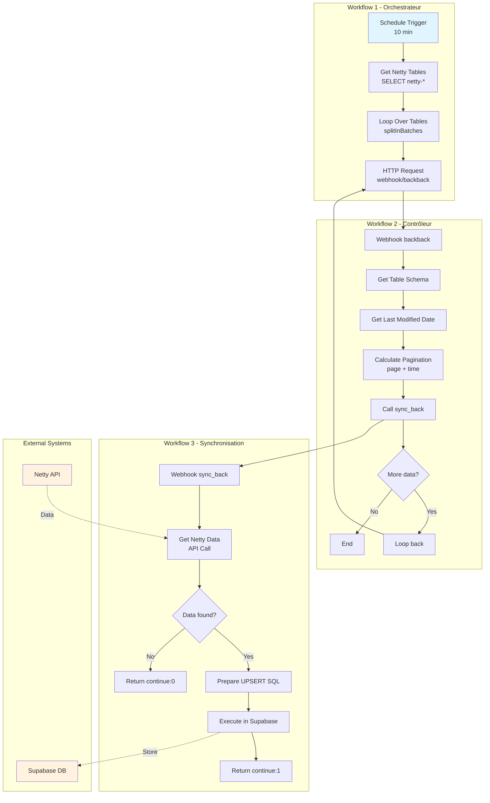
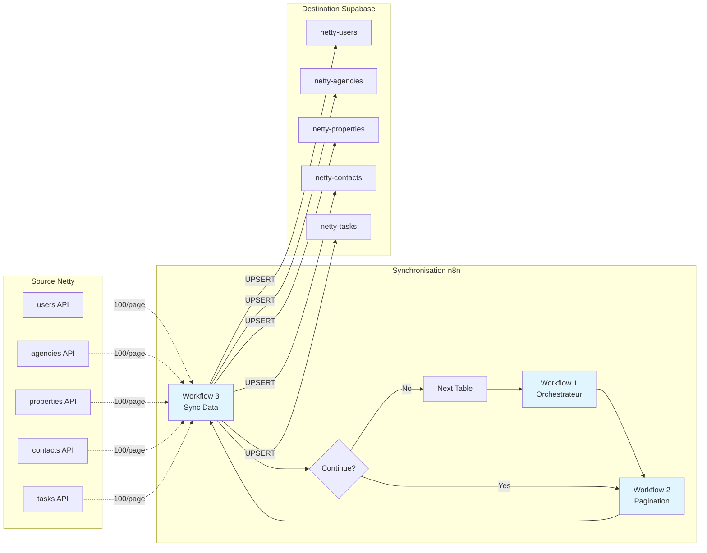
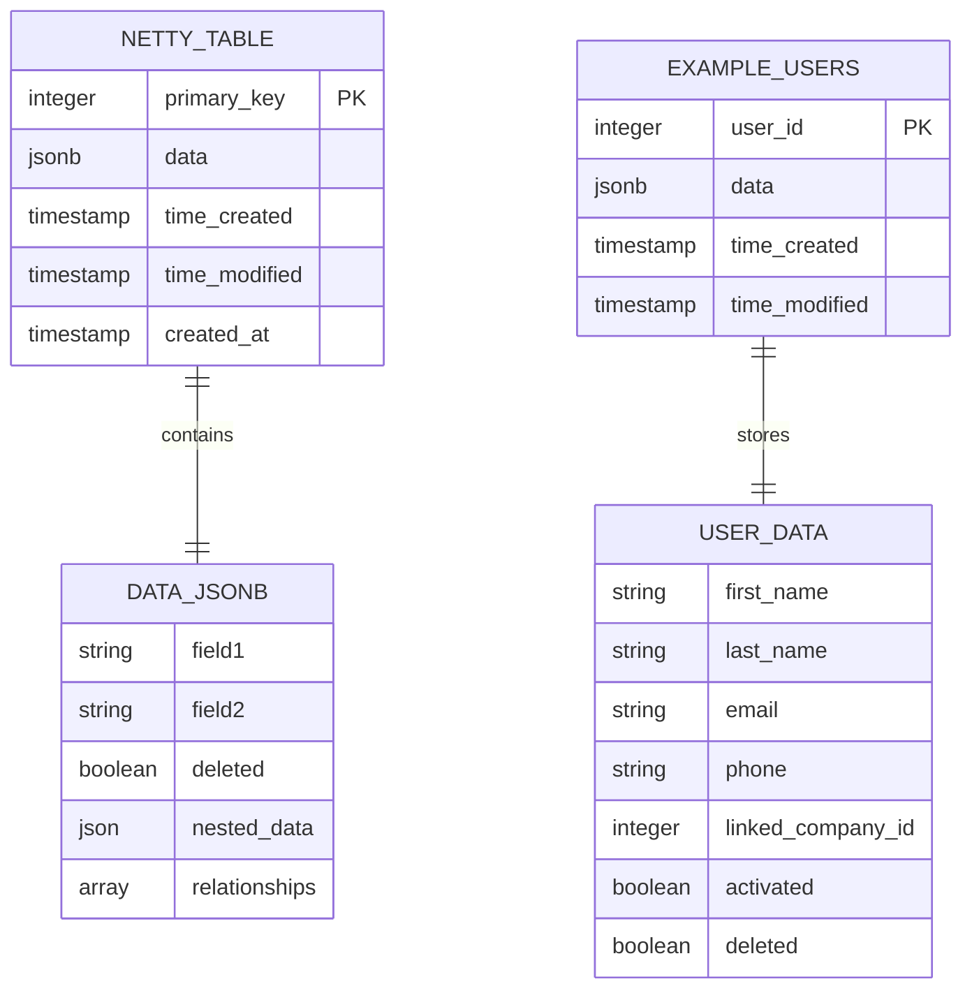

# 🔄 Flux de Données Back Office

## 🎯 Vue d'ensemble

Le système de synchronisation des données Back Office de Weinvest repose sur 3 workflows n8n interconnectés qui assurent la synchronisation bidirectionnelle entre l'API Netty et la base de données Supabase. Ce système maintient une copie locale des données Netty pour les dashboards et analyses.

### 🏗️ Architecture

```
Workflow 1 (Orchestrateur)
    ↓
Workflow 2 (Contrôleur de pagination)
    ↓
Workflow 3 (Synchronisation des données)
```

### 📊 Schéma détaillé du système



## 📊 Workflow 1 : Orchestrateur Principal

### 📊 Description
- **URL** : https://primary-production-b292d.up.railway.app/workflow/0rIHNzcwRFalRjXH
- **Déclencheur** : Schedule Trigger toutes les 10 minutes
- **Objectif** : Identifier et lancer la synchronisation de toutes les tables Netty

### ⚙️ Étapes du processus

1. **Identification des tables à synchroniser**
   ```sql
   SELECT table_name 
   FROM information_schema.tables 
   WHERE table_schema = 'public' 
   AND table_name LIKE 'netty-%'
   ```

2. **Boucle sur chaque table**
   - Utilisation du node `splitInBatches` pour traiter table par table
   - Appel séquentiel pour éviter la surcharge

3. **Déclenchement workflow 2**
   ```http
   GET https://primary-production-b292d.up.railway.app/webhook/backback
   ?table_name={table_name}
   ```

### 🔄 Flux de données
- **Input** : Aucun (déclenché par schedule)
- **Output** : Liste des tables à synchroniser
- **Volume** : ~10-20 tables selon configuration

## 📊 Workflow 2 : Contrôleur de Pagination

### 📊 Description
- **URL** : https://primary-production-b292d.up.railway.app/workflow/DW4E8e480mUDm6ZU
- **Endpoint** : `/backback`
- **Objectif** : Gérer la pagination et l'état de synchronisation pour chaque table

### ⚙️ Étapes du processus

1. **Récupération du schéma de table**
   ```sql
   SELECT 
       c.column_name,
       c.data_type,
       c.character_maximum_length,
       c.column_default,
       c.is_nullable,
       CASE 
           WHEN tc.constraint_type = 'PRIMARY KEY' THEN true 
           ELSE false 
       END as is_primary_key
   FROM information_schema.columns c
   LEFT JOIN information_schema.key_column_usage kcu 
       ON c.table_schema = kcu.table_schema 
       AND c.table_name = kcu.table_name 
       AND c.column_name = kcu.column_name
   LEFT JOIN information_schema.table_constraints tc 
       ON kcu.constraint_schema = tc.constraint_schema 
       AND kcu.constraint_name = tc.constraint_name
   WHERE 
       c.table_schema = 'public'
       AND c.table_name = '{table_name}'
   ORDER BY c.ordinal_position
   ```

2. **Détermination de la date de dernière modification**
   ```sql
   SELECT MAX(time_modified) as date_modification 
   FROM "{table_name}"
   ```

3. **Calcul de la pagination**
   ```javascript
   // Gestion de la page courante
   let currentNumber = 0;
   if ($("Code3")) {
     currentNumber = Number($("Code3").last().json.numlber);
   }
   
   // Ajustement du timestamp (UTC-2h)
   return { 
     page: currentNumber,
     time: new Date(new Date(lastModified).getTime() - 2 * 60 * 60 * 1000).toISOString()
   }
   ```

4. **Appel workflow 3 pour synchronisation**
   ```http
   POST https://primary-production-b292d.up.railway.app/webhook/sync_back
   ?table_name={table_name_sans_prefix}
   ?page={page}
   ?time={time}
   
   Body: {
     "shema": [schema_info]
   }
   ```

5. **Gestion de la continuation**
   - **If1** : Vérifie si la date max locale est dépassée
   - **If** : Vérifie le flag `continue` (1 = plus de données)
   - Si oui → rappel récursif du workflow

### 🔄 États de synchronisation
- **Continue = 1** : Il reste des pages à synchroniser
- **Continue = 0** : Synchronisation terminée pour cette table
- **Timeout safety** : Ajout de 1h au timestamp pour éviter les données manquées

## 📊 Workflow 3 : Synchronisation des Données

### 📊 Description
- **URL** : https://primary-production-b292d.up.railway.app/workflow/lbzJ5ONapGnSwt4A
- **Endpoint** : POST `/sync_back`
- **Objectif** : Récupérer et synchroniser les données page par page

### ⚙️ Étapes du processus

1. **Récupération des données Netty**
   ```http
   GET https://webapi.netty.fr/apiv1/{table_name}
   Headers:
     x-netty-api-key: 41021a5a-a244-452b-af21-02d1d1672788
     accept: application/json
   Query:
     sort: time_modified:asc
     limit: 100
     offset: {page * 100}
     filters: time_modified:greater:{time - 2h}
   ```

2. **Traitement des données** (Node Prepare Data1)
   ```javascript
   // Structure de l'upsert
   const baseFields = {
     [primaryKey]: item[primaryKey],     // Clé primaire
     data: dataObject,                   // JSON nettoyé
     time_modified: item.time_modified,  // Timestamp
     time_created: item.time_created     // Timestamp
   };
   
   // Suppression des champs système du JSON data
   delete dataObject[primaryKey];
   delete dataObject.time_modified;
   delete dataObject.time_created;
   dataObject.deleted = item.deleted || false;
   ```

3. **Génération SQL UPSERT**
   ```sql
   INSERT INTO "netty-{table_name}" (columns)
   VALUES (values)
   ON CONFLICT ("{primary_key}") DO UPDATE SET
     "data" = "netty-{table_name}"."data" || EXCLUDED."data",  -- Fusion JSONB
     "time_modified" = EXCLUDED."time_modified"
   ```

4. **Gestion de la réponse**
   - Si données trouvées → retour `continue: 1` avec dernière `time_modified`
   - Si aucune donnée → retour `continue: 0` avec time + 5h

### 📦 Structure des tables Supabase

Toutes les tables `netty-*` suivent cette structure :
```sql
CREATE TABLE "netty-{nom}" (
  {primary_key} INTEGER PRIMARY KEY,
  data JSONB NOT NULL,
  time_created TIMESTAMP WITH TIME ZONE,
  time_modified TIMESTAMP WITH TIME ZONE,
  created_at TIMESTAMP WITH TIME ZONE DEFAULT timezone('utc', now())
);
```

## 🔐 Sécurité et Configuration

### 🔑 Credentials
- **Supabase PostgreSQL** : ID `88poxiTdcD5sbRv6`
- **Netty API Key** : `41021a5a-a244-452b-af21-02d1d1672788`

### ⏰ Paramètres temporels
- **Schedule** : Toutes les 10 minutes
- **Timeout HTTP** : 20 secondes
- **Retry** : Activé avec 5 secondes entre tentatives
- **Décalage UTC** : -2h pour synchronisation avec Netty

### 🛡️ Protection des données
- Utilisation de requêtes préparées (échappement SQL)
- Validation des schémas avant insertion
- Gestion des erreurs avec fallback NULL

## 🚨 Points d'attention

### 1. **Gestion de la pagination**
- Limite de 100 items par page (API Netty)
- Pagination séquentielle pour éviter les données manquées
- Reset automatique si dépassement de date

### 2. **Fusion JSONB**
- La colonne `data` utilise l'opérateur `||` pour fusion
- Préserve les données existantes lors des updates
- Attention aux conflits de clés dans le JSON

### 3. **Performances**
- Traitement item par item (`runOnceForEachItem`)
- Pas de traitement parallèle pour éviter les conflits
- Index recommandés sur `time_modified` et clés primaires

### 4. **Décalage temporel**
- -2h systématique sur les requêtes Netty
- +1h de sécurité sur la vérification locale
- +5h si aucune donnée (évite les boucles)

### 5. **Tables supportées**
Pattern de nommage : `netty-{nom_table}`
Tables courantes :
- `netty-users`
- `netty-agencies`
- `netty-properties`
- `netty-contacts`
- `netty-tasks`

## 📈 Monitoring et Maintenance

### 📊 Métriques à suivre
1. **Durée de synchronisation** par table
2. **Volume de données** synchronisées
3. **Erreurs de timeout** ou API
4. **Décalage temporel** entre Netty et local

### 🔧 Maintenance
- Vérifier régulièrement les logs n8n
- Monitorer l'espace disque Supabase
- Valider l'intégrité des données JSONB
- Nettoyer les données obsolètes (deleted = true)

### 🚀 Optimisations possibles
1. Parallélisation des tables indépendantes
2. Compression des données JSONB anciennes
3. Archivage des données > 1 an
4. Index sur les champs JSON fréquemment requêtés

## 🔄 Flux de synchronisation complet

```
Schedule (10 min)
    ↓
[Workflow 1] Liste tables netty-*
    ↓
Pour chaque table:
    ↓
[Workflow 2] Get schema + last modified
    ↓
[Workflow 3] Page 0 → Get 100 items → Upsert
    ↓
Continue? → [Workflow 3] Page 1 → Get 100 items → Upsert
    ↓
... jusqu'à continue = 0
    ↓
Table suivante
```

### 📊 Schéma de flux de données



### 📊 Structure des données synchronisées



## 🛠️ Dépannage

### Problèmes courants

1. **Timeout sur grandes tables**
   - Augmenter timeout dans HTTP Request
   - Réduire la limite à 50 items

2. **Données manquantes**
   - Vérifier le décalage temporel
   - Forcer resync avec time = NULL

3. **Erreurs JSONB**
   - Valider le JSON avant insertion
   - Échapper correctement les apostrophes

4. **Boucle infinie**
   - Vérifier la logique continue
   - Limiter le nombre de pages max 