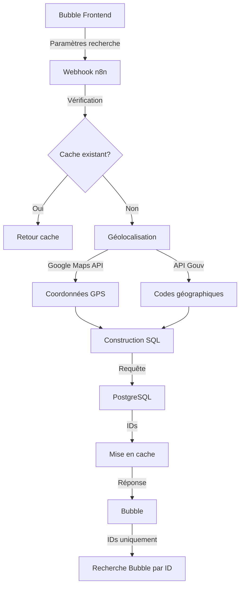

# 🔍 Système de Recherche Avancée

## 🎯 Vue d'ensemble

Le système de recherche a été développé pour contourner les limitations de Bubble en matière de recherches complexes. Il utilise PostgreSQL pour exécuter des requêtes SQL sophistiquées et retourne uniquement une liste d'IDs que Bubble peut ensuite utiliser.

### 💡 Pourquoi ce système ?


**Limitations de Bubble** :
- Pas de support pour les recherches géospatiales
- Difficultés avec les filtres multiples et les opérateurs complexes
- Performances limitées sur les grandes volumétries
- Pas de support natif des arrays PostgreSQL

**Solution** : Duplication de la table `properties` et création d'un système de recherche SQL externe


## 🔄 Workflow de Recherche (n8n)

### ⚡ Description


**URL du webhook** : https://sync-webhook.weinvest.app/webhook/searchproperty


Ce workflow n8n gère les recherches complexes de biens immobiliers avec géolocalisation, filtres multiples et mise en cache.

### 🔄 Fonctionnement détaillé

#### 1. 🌐 Réception de la requête
- **Webhook** : Reçoit les paramètres de recherche depuis Bubble
- **Nettoyage du cache** : Suppression des entrées de plus de 24h
- **Vérification du cache** : Si la requête existe déjà, retour immédiat

#### 2. 📍 Géolocalisation (si localisation fournie)
- **API Google Maps** : Conversion adresse → coordonnées GPS
- **Extraction des composants** :
  - Code postal
  - Ville
  - Département
  - Région
- **APIs gouvernementales** : 
  - Récupération des codes départements depuis nom
  - Liste des départements d'une région

#### 3. 🔨 Construction de la requête SQL

**Structure de base** :
```sql
SELECT _id 
FROM properties 
WHERE deleted = false 
AND EXISTS (
  SELECT 1 FROM directories 
  WHERE directories.temp_slug = properties.agency_slug
  AND directories._id IS NOT NULL
)
```

**Filtres disponibles** :

| Paramètre | Type | Description | Opérateur SQL |
|-----------|------|-------------|---------------|
| localisation | string | Adresse ou ville | Géospatial + LIKE |
| distance | number | Rayon en km | earth_distance() |
| budget-min/max | number | Prix min/max | >= / <= |
| chambre-min | number | Nombre chambres min | >= |
| piece-min | number | Nombre pièces min | >= |
| surface-min/max | number | Surface habitable | >= / <= |
| etage-min | number | Étage minimum | >= |
| type_offre | number | 1=Vente, 2=Location | = |
| equipements | array | Liste équipements | && (overlap) |
| expositions | array | Orientations | && (overlap) |
| types-bien | array | Types de biens | && (overlap) |

#### 4. 🗺️ Recherche géospatiale

```sql
-- Calcul de distance avec PostGIS
earth_distance(
    ll_to_earth(latitude, longitude), 
    ll_to_earth(${lat}, ${lng})
) <= ${distance * 1000}
```

**Combinaison avec OR** :
- Distance géographique
- Code postal exact
- Ville exacte
- Département (LIKE 'XX%')
- Tous les départements d'une région

#### 5. 🔄 Gestion des arrays PostgreSQL

**Opérateurs utilisés** :
- `&&` : Overlap (au moins un élément en commun)
- `<@` : Contained (tous les éléments recherchés présents)

**Exemples** :
```sql
-- Au moins un équipement correspond
ARRAY['Balcon','Terrasse'] && equipment

-- Propriété a tous les équipements demandés
ARRAY['Balcon','Terrasse'] <@ equipment
```

#### 6. 💾 Mise en cache

- **Table** : `searchCash`
- **Clé** : Hash encodé des paramètres de recherche
- **Durée** : 24 heures
- **Format** : JSON avec liste des IDs et clé

### 📊 Structure du cache

| Champ | Type | Description |
|-------|------|-------------|
| id | string | Hash unique de la requête |
| reponse | jsonb | {ids: [...], key: "..."} |
| created_at | timestamp | Date de création (auto) |

### 🔄 Flux de données



### ⚡ Optimisations

1. **Cache intelligent** : Évite les recalculs pour les mêmes recherches
2. **Requêtes indexées** : Utilisation des index PostgreSQL
3. **Filtrage préalable** : Seulement les biens avec agents actifs
4. **Arrays natifs** : Performance optimale avec PostgreSQL

### 🚨 Points d'attention

- **Sécurité SQL** : Échappement systématique des valeurs avec `escapeSQLValue()`
- **Limites API** : Google Maps API a des quotas
- **Cohérence** : La table properties doit être synchronisée
- **Performance** : Les recherches géospatiales peuvent être lourdes
- **Cache** : Nettoyage automatique mais peut grossir rapidement

### 🔧 Configuration requise

- **Extensions PostgreSQL** :
  - `earthdistance` : Calculs de distance
  - `cube` : Support des coordonnées
- **APIs externes** :
  - Google Maps Geocoding API
  - API Géo du gouvernement français
- **Tables** :
  - `properties` : Données des biens
  - `directories` : Annuaire agents/agences
  - `searchCash` : Cache des recherches

### 📈 Exemple de requête complexe

```json
{
  "localisation": "Lyon",
  "distance": 10,
  "budget-min": 200000,
  "budget-max": 500000,
  "chambre-min": 2,
  "surface-min": 60,
  "type_offre": 1,
  "equipements": "Balcon,Parking",
  "types-bien": "Appartement"
}
```

Génère une requête SQL qui :
1. Géolocalise Lyon
2. Cherche dans un rayon de 10km
3. Filtre sur le budget 200-500k€
4. Minimum 2 chambres et 60m²
5. Type vente uniquement
6. Avec balcon ET parking
7. Appartements uniquement

### 🔗 Intégration avec Bubble

**Côté Bubble** :
1. Collecte des critères de recherche
2. Appel du webhook avec les paramètres
3. Réception de la liste d'IDs
4. Recherche Bubble : `Property's ID is in list [IDs]`
5. Affichage des résultats

**Avantages** :
- Bubble gère uniquement l'affichage
- Les calculs complexes sont externalisés
- Performance optimale
- Possibilité d'évolution sans toucher Bubble 