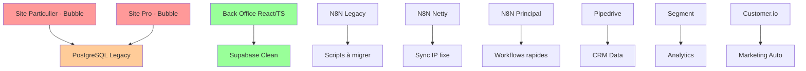

# Template de Passation Weinvest

## 📋 Informations Générales

**Date de début de passation :** [Date]  
**Personne qui transmet :** [Votre nom]  
**Personnes qui reçoivent :** [Noms des repreneurs]  
**Contexte de la passation :** [Départ, changement de poste, etc.]

---

## 🏗️ Architecture Générale du Système Weinvest

### Vue d'ensemble des composants



### Technologies principales
- **Front-end Sites :** Bubble (no-code)
- **Back Office :** React TypeScript + Cursor/VibeCoding
- **Bases de données :** PostgreSQL (legacy) + Supabase (moderne)
- **Automatisation :** N8N (3 instances)
- **CRM/Marketing :** Pipedrive + Segment + Customer.io

---

## 🚨 POINTS CRITIQUES - À LIRE EN PRIORITÉ

### ⚠️ Systèmes fragiles nécessitant une attention particulière
1. **Base PostgreSQL des sites** : Vieille structure, nécessite un nettoyage urgent
2. **Instance N8N Legacy** : Scripts obsolètes mais encore en fonctionnement
3. **Dashboards Back Office** : Trop lourds, migration Metabase recommandée

### 🔥 Dettes techniques majeures
1. **[Décrire la dette technique la plus critique]**
   - Impact : [Impact business]
   - Urgence : [Haute/Moyenne/Basse]
   - Solution recommandée : [Description]

2. **[Autre dette technique majeure]**
   - Impact : [Impact business]
   - Urgence : [Haute/Moyenne/Basse]
   - Solution recommandée : [Description]

### 🩹 Patches temporaires en place
| Système | Patch | Risque | Action recommandée |
|---------|-------|--------|-------------------|
| [Système] | [Description patch] | [Niveau risque] | [Action à prendre] |

---

## 🗂️ Accès et Credentials

### 🔐 Accès critiques
| Service | URL/Accès | Credentials | Notes |
|---------|-----------|-------------|-------|
| Back Office | [URL] | [Contact pour accès] | Supabase auth |
| PostgreSQL | [Host] | [Contact pour credentials] | Base legacy |
| Supabase | [URL] | [Contact pour accès] | Base moderne |
| N8N Legacy | [URL] | [Contact] | À migrer |
| N8N Netty | [URL] | [Contact] | IP fixe |
| N8N Principal | [URL] | [Contact] | Instance rapide |
| Pipedrive | [URL] | [Contact] | CRM |
| Segment | [URL] | [Contact] | Analytics |
| Customer.io | [URL] | [Contact] | Marketing |

### 🔑 Qui contacter pour les accès
- **Développement :** [Nom + contact]
- **Infrastructure :** [Nom + contact]
- **Marketing/CRM :** [Nom + contact]

---

## 💻 Environnement de Développement

### Setup local Back Office
1. **Prérequis :**
   ```bash
   # Node.js version requise
   node --version  # [Version requise]
   
   # Package manager
   npm --version   # ou yarn/pnpm
   ```

2. **Installation :**
   ```bash
   git clone [URL_REPO]
   cd [nom-projet]
   npm install
   cp .env.example .env.local
   # Configurer les variables d'environnement
   npm run dev
   ```

3. **Variables d'environnement critiques :**
   ```env
   NEXT_PUBLIC_SUPABASE_URL=
   NEXT_PUBLIC_SUPABASE_ANON_KEY=
   SUPABASE_SERVICE_ROLE_KEY=
   # [Autres variables importantes]
   ```

### Configuration Cursor
- **Rules importantes :** [Lien vers .cursorrules]
- **Agents IA configurés :** [Liste des agents]
- **Workflows spécifiques :** [Description]

---

## 🔄 Workflows Critiques

### 1. Workflow Client Type (Ex: Onboarding)
```
[Étape 1] → [Système impliqué] → [Action]
↓
[Étape 2] → [Système impliqué] → [Action]
↓
[Etc...]
```

**Points de vigilance :**
- [Point critique 1]
- [Point critique 2]

### 2. Processus de Synchronisation
- **Fréquence :** [Ex: toutes les heures]
- **Systèmes impliqués :** [Liste]
- **Monitoring :** [Comment vérifier que ça fonctionne]
- **En cas d'échec :** [Procédure]

---

## 📊 Métriques et Monitoring

### KPIs Business à surveiller
| Métrique | Source | Fréquence | Seuil d'alerte |
|----------|--------|-----------|----------------|
| [Ex: Conversions] | [Système] | [Quotidien] | [< X%] |
| [Autre métrique] | [Système] | [Hebdo] | [Valeur] |

### Alertes techniques importantes
- **Base de données :** [Seuils CPU, mémoire, espace]
- **N8N :** [Workflows en échec]
- **APIs :** [Temps de réponse, erreurs]

### Dashboards existants
1. **[Nom dashboard]**
   - URL : [Lien]
   - Contenu : [Description]
   - Problèmes connus : [Liste]

---

## 🛠️ Maintenance Régulière

### Tâches quotidiennes
- [ ] Vérifier dashboards principaux
- [ ] Contrôler N8N workflows
- [ ] [Autre tâche]

### Tâches hebdomadaires
- [ ] Backup PostgreSQL
- [ ] Nettoyage logs
- [ ] [Autre tâche]

### Tâches mensuelles
- [ ] Revue performance bases
- [ ] Audit sécurité accès
- [ ] [Autre tâche]

---

## 📞 Contacts Essentiels

### Support technique
| Personne/Service | Rôle | Contact | Disponibilité |
|------------------|------|---------|---------------|
| [Nom] | DevOps/Infrastructure | [Email/Tél] | [Horaires] |
| [Nom] | Développement | [Email/Tél] | [Horaires] |
| [Service] | Support Bubble | [Contact] | [Heures] |

### Prestataires externes
| Prestataire | Service | Contact | Notes |
|-------------|---------|---------|-------|
| [Nom] | [Service] | [Contact] | [Infos importantes] |

---

## 📈 Recommandations Prioritaires

### 🎯 Court terme (1-3 mois)
1. **Migration Dashboards vers Metabase**
   - Effort : [X jours/personne]
   - Impact : [Amélioration performance]
   - Prérequis : [Liste]

2. **Nettoyage PostgreSQL**
   - Effort : [X jours/personne]
   - Impact : [Amélioration performance]
   - Risques : [Liste des risques]

### 🚀 Moyen terme (3-6 mois)
1. **Consolidation N8N**
   - Migration legacy vers instances modernes
   - Rationalisation des workflows
   - Amélioration monitoring

### 🔮 Long terme (6-12 mois)
1. **Refonte architecture globale**
   - Modernisation stack technique
   - Amélioration intégrations
   - Optimisation performances

---

## ❓ Questions Fréquentes

### Q: Que faire si [problème courant] ?
**R:** [Solution détaillée]

### Q: Comment [action courante] ?
**R:** [Procédure étape par étape]

### Q: Qui contacter pour [situation] ?
**R:** [Contact approprié]

---

## 📝 Journal de Passation

### [Date] - Session 1
- **Participants :** [Liste]
- **Sujets abordés :** [Liste]
- **Actions à suivre :** [Liste]
- **Prochaine session :** [Date]

### [Date] - Session 2
- **Participants :** [Liste]
- **Sujets abordés :** [Liste]
- **Actions à suivre :** [Liste]
- **Prochaine session :** [Date]

---

## ✅ Checklist de Validation de la Passation

### Accès et permissions
- [ ] Accès aux environnements de développement
- [ ] Accès aux bases de données
- [ ] Accès aux outils tiers (Pipedrive, etc.)
- [ ] Permissions GitBook/documentation

### Compréhension technique
- [ ] Architecture générale comprise
- [ ] Capacité à déployer le back office
- [ ] Compréhension des workflows N8N critiques
- [ ] Connaissance des intégrations principales

### Processus opérationnels
- [ ] Procédures de maintenance connues
- [ ] Contacts d'escalation identifiés
- [ ] Monitoring et alertes compris
- [ ] Gestion des incidents maîtrisée

### Documentation
- [ ] Documentation mise à jour
- [ ] Accès GitBook configuré
- [ ] Processus de mise à jour documenté
- [ ] Knowledge base organisée

---

## 📚 Ressources Complémentaires

- **Documentation technique :** [Liens]
- **Tutoriels internes :** [Liens]
- **Ressources externes :** [Liens vers docs officielles]
- **Formation recommandée :** [Liste cours/certifications]

---

*Ce document doit être maintenu à jour régulièrement. Dernière mise à jour : [Date]*